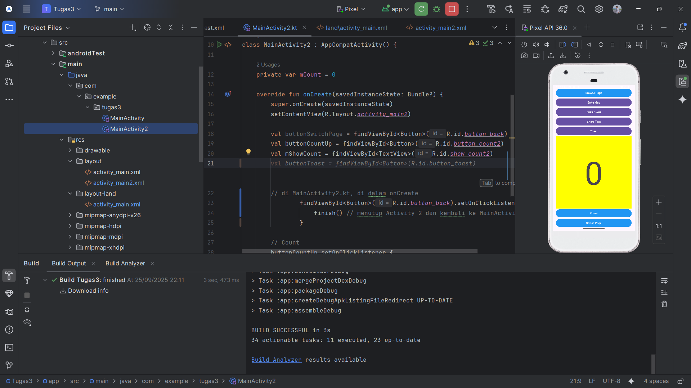
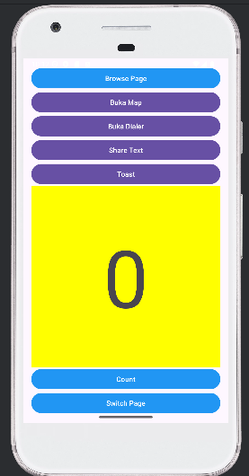
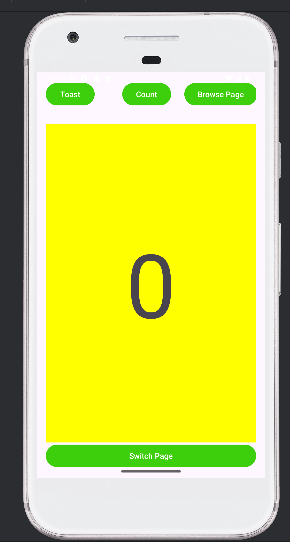
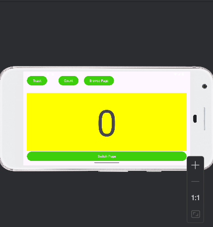

# 📱 Tugas 3 — Relative/Constraint Layout, Activity, Explicit & Implicit Intent

## 👤 Pembuat
**Hilman Maulana** — UIN Sunan Gunung Djati Bandung  
Kelas: **Pengembangan Aplikasi Web (D)**  
NIM: **1237050020**

---

## 🖼️ Preview

## 🖼️ Running Aplikasi Layout 1

## 🖼️ Running Aplikasi Layout 2

## 🖼️ Preview Landscape

---

## 📚 Deskripsi Singkat
Implementasi:
- **Layout ganda** (portrait & landscape) menggunakan **ConstraintLayout** *(atau RelativeLayout sesuai materi)*
- **Activity kedua (`MainActivity2`)** dengan **Explicit Intent** dari `MainActivity`
- **Implicit Intent**:
  - **Browser** (`ACTION_VIEW` + URL)
  - **Map** (`ACTION_VIEW` + `geo:` URI)
  - **Dialer** (`ACTION_DIAL` + `tel:`)
  - **Share** (`ACTION_SEND` + `text/plain`)
- **Counter & Toast** pada halaman utama

---

## 🧩 Fitur
- Tombol **Count** menambah angka pada `TextView`
- Tombol **Toast** menampilkan nilai saat ini
- Tombol **Switch Page** membuka `MainActivity2` (explicit)
- Tombol **Browse / Map / Dial / Share** menjalankan implicit intent

---

## 🗂️ Struktur Proyek
